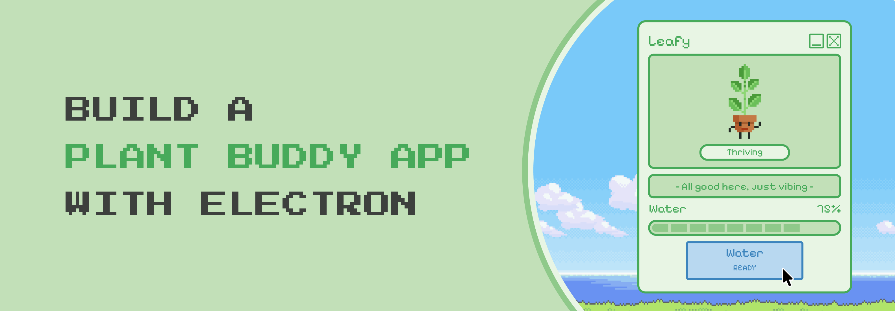
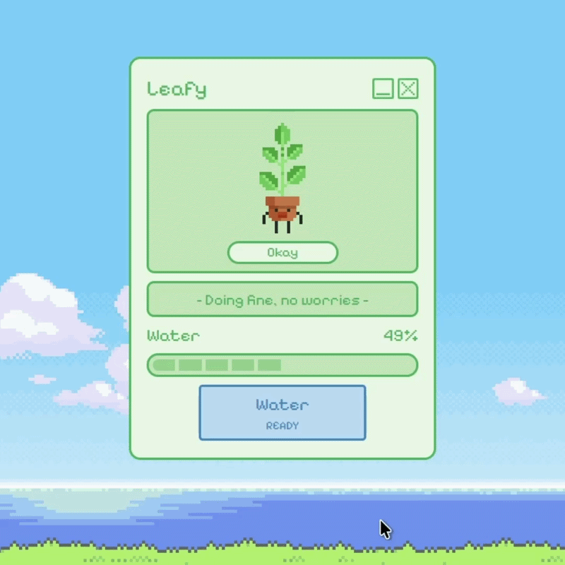
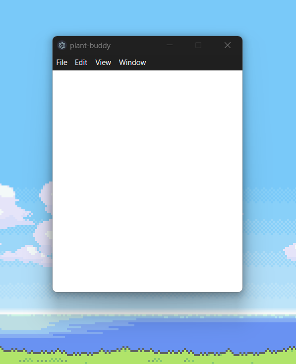
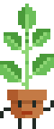
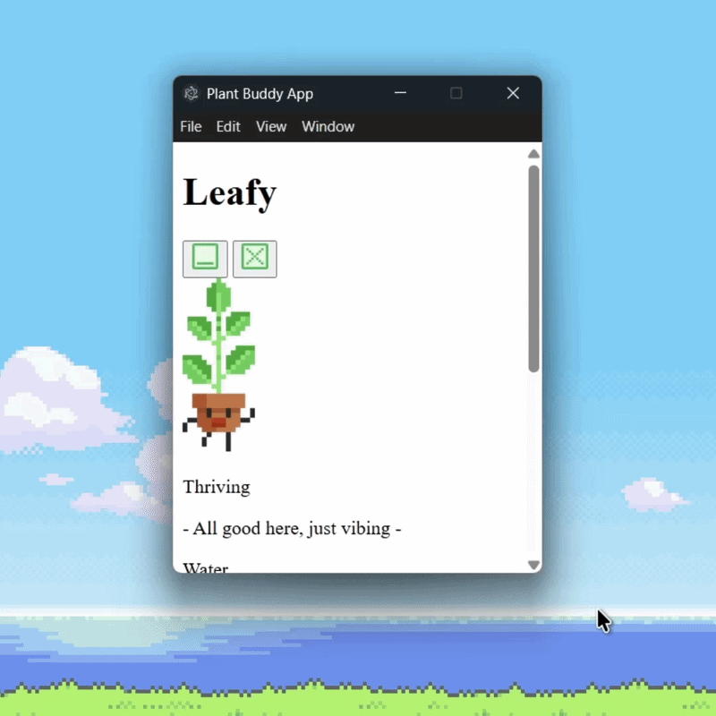
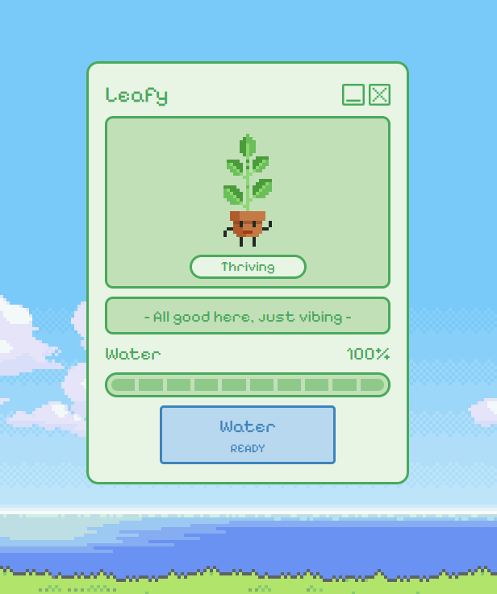

<div align="center">
  
</div>  
 
 # Build a Plant Buddy App with Electron
```bash
Prerequisites: HTML, CSS, JavaScript fundamentals
Versions: Electron 42.4.0
```

## Introduction
What if your desktop had its own little Tamagotchi, except instead of feeding a digital pet, you're keeping a tiny plant alive? That's exactly what we're building today, a tiny desktop app that mimics a virtual plant you need to take care of!

Here's a quick look at it in action 🌱:

<div align="center">
  
</div>

To build our Plant Buddy we'll be using [Electron](https://www.electronjs.org/docs/latest/), a framework that turns familiar web technologies like HTML, CSS, and JavaScript into real, installable desktop apps. We're using it here because it's super beginner-friendly and lets you skip learning a whole new language or stack. If you can build a webpage, you already have what it takes to build this project!

For this tutorial, we'll be following a simple design I put together in [Figma](https://www.figma.com/community/file/1650050617386672796/plant-buddy), so you'll be styling the app to match it exactly. Feel free to use it as your guide, or tweak the colors, layout, and sprites to make your own version once you're done!

With that said, let's get our project set up! ✨

## Getting Started
First, we’ll set up Electron, then create our project files, and lastly make sure the app actually runs before we start building anything.

To follow along, all you need is a code editor of your choice and [Node.js](https://nodejs.org/en) to load and manage dependencies.

### Installing Electron
Start by creating a new project folder named `plant-buddy` and initialize it in your terminal:

```bash
npm init -y
```

This automatically generate a `package.json` file. Think of it as your project's ID card because it keeps track of your app's name, versions, and dependencies.

Now let's install the two packages we need 📦:

```bash
npm install --save-dev electron
npm install --save-dev electron-reload
```
The `--save-dev` flag tells npm these are development tools, meaning they're only needed while building the app and not in the final product. `electron-reload` is especially handy because it automatically refreshes the app every time you save a file, so you're not constantly restarting it manually.

We'll only have to restart the app whenever we add something to the `main.js`, since it controls the main process and any changes here need a full restart to take effect, unlike the `index.html`, `style.css`, and `script.js`.

Also, you may have noticed a `node_modules/` folder and a `package-lock.json` file were automatically generated too. These store Electron and all its dependencies. They update on their own as your project grows, so just leave them be!

### Creating Your Project Files
Now let's create the project files we'll be working with 📁:

- `main.js` to control the app window and talk to your operating system.
- `index.html` to render the application.
- `style.css` to customize the appearance.
- `script.js` to handle the logic and interactions.

At this point your project folder should look like this:

```bash
plant-buddy/
├── node_modules/
├── index.html
├── main.js
├── package-lock.json
├── package.json
├── script.js
└── style.css
```

### Configuring package.json
Open the `package.json` file that was just generated and look for the `"main"` field. Change it from `"index.js"` to `"main.js"`. This tells Electron which file to run first, which will be our main process file.

Also replace the default `"test"` script with `"start": "electron ."` because this is what runs your app when you type `npm start` in the terminal. 

```json
{
  "main": "index.js",
  "scripts": {
    "test": "echo \"Error: no test specified\" && exit 1"
  }
}
```

This is how they should look:

```json
{
  "main": "main.js",
  "scripts": {
    "start": "electron ."
  }
}
```

Don't worry about the rest of the fields, you can leave them as they are. They won't interfere with running your program. Only these two are most important.

### Setting Up main.js
`main.js` is the first thing Electron runs when you launch your app. Open it and paste this in:

```js
const { app, BrowserWindow } = require('electron');

function createWindow() {
  const win = new BrowserWindow({
    width: 320,
    height: 420,
    resizable: false,
    maximizable: false,
    fullscreenable: false,
    center: true,
    alwaysOnTop: true,
    webPreferences: {
      nodeIntegration: true,
      contextIsolation: false
    }
  });

  win.loadFile('index.html');
};

app.whenReady().then(createWindow);
```

The `BrowserWindow` is how Electron creates a window on your desktop. Inside it we define how that window looks and behaves. These are called attributes, and here are the most relevant ones: `width` and `height` to set a fixed window size, and `alwaysOnTop` so your plant buddy stays visible on your desktop. The last line tells Electron to wait until the app is ready before creating the window and loading `index.html` into it.

Then add this line at the very top of your `main.js`:

```js
require('electron-reload')(__dirname) // electron-reload
```

From now on every time you save a change, your app will refresh automatically.

Now with everything set up, try running `npm start` in your terminal. If a small blank window pops up on your screen, you're good to go. Let’s start building! 🛠️

<div align="center">
  
</div>

## Building Plant Buddy
Before we continue, head over to the [plant-buddy](https://github.com/sh3rqxs/plant-buddy) repository and get the `assets/` folder. It contains the icons we'll use for the title bar and the plant sprites for each mood.

Also, the folder includes three different plants to choose from, so feel free to pick your favorite! Just make sure the `src` path matches the folder name of the plant you choose. For this tutorial I'll be going with the **leafy stem plant**. 🌱

You can get all the files by **cloning the repo** or **downloading it as a ZIP**, then grab the `assets/` folder and drop it into your `plant-buddy` project folder.

### HTML
First, open `index.html` and paste this in:

```html
<!DOCTYPE html>
<html lang="en">
<head>
  <meta charset="UTF-8" />
  <meta name="viewport" content="width=device-width, initial-scale=1.0" />
  <title>Plant Buddy App</title>
</head>
<body>
  <!-- Your code goes here! -->
</body>
</html>
```

This is the base structure of our app. The `<title>` tag sets the name that appears in your taskbar, and the `<body>` is where we'll be adding everything the user sees. Right now it's empty, but not for long!

Just below the `<title>` tag, add the font link from [Google Fonts](https://fonts.google.com/specimen/Pixelify+Sans?query=pixelify+sans) and your stylesheet:

```html
  <!-- Font -->
  <link rel="preconnect" href="https://fonts.googleapis.com" />
  <link rel="preconnect" href="https://fonts.gstatic.com" crossorigin />
  <link
    href="https://fonts.googleapis.com/css2?family=Pixelify+Sans:wght@400..700&display=swap"
    rel="stylesheet"
  />
  <!-- Style -->
  <link rel="stylesheet" href="style.css" />
```

We're using **Pixelify Sans** for that fun retro pixel feel. The `preconnect` links help the browser load it faster by connecting to Google Fonts early. Right below it we link `style.css` so our styles are applied to the app.

Then inside the `<body>` at the very bottom, add your script:

```html
  <!-- Script -->
  <script src="script.js"></script>
```

We load it last so the page content is ready before the JavaScript runs.

Now let’s start building the body. Add this div inside the `<body>` tag:

```html
	<!-- App's content -->
	<div class="app" style="-webkit-app-region: drag;">

	</div>
```

This is the main container that will hold all of our app's content. The `style="-webkit-app-region: drag"` is what makes the window draggable, so your plant buddy can be moved around the desktop.

#### Title Bar
Next, paste this inside the `app` div to build the title bar:

```html
    <!-- Title bar -->
    <div class="title-bar">
      <!-- Plant's name -->
      <h1 id="plants-name">Plant's name</h1>
      <div class="title-bar-btns">
        <!-- Minimize button -->
        <button class="title-bar-btn" id="minimize">
          
        </button>
        <!-- Close button -->
        <button class="title-bar-btn" id="close">
          
        </button>
      </div>
    </div>
```

The `<h1>` tag holds your plant's name, so feel free to change `"Plant's name"` to whatever you want to call yours! Next to it are the minimize and close buttons, each using the icons from the `assets/` folder we added earlier.

#### Plant Zone
Then add the plant zone below the title bar:

```html
    <!-- Plant zone -->
    <div class="plant-zone">
      <!-- Plant illustration -->
      
      <!-- Mood tag -->
      <div class="mood-tag">
        <p id="mood">Thriving</p>
      </div>
    </div>
```

The `` tag displays your plant's sprite, which starts on the thriving state by default. Just below it, the mood tag shows a little label that matches your plant's current mood. Both the sprite and the mood text will update dynamically as your plant's health changes.

#### Care Reminder
Right below the plant zone, add the care reminder:

```html
    <!-- Care reminder -->
    <div class="care-reminder">
      <span id="message">- All good here, just vibing -</span>
    </div>
```

This displays a little message that matches your plant's current mood. Right now it's set to the thriving message by default, but just like the sprite and mood tag, it will update automatically based on how your plant is feeling.

#### Water Meter
Now to build the water meter, paste this below the care reminder:

```html
    <!-- Water meter -->
    <div class="water-meter">
      <!-- Water label -->
      <div class="water-label">
        <p id="water">Water</p>
        <p id="percentage">100%</p>
      </div>
      <!-- Water bar -->
      <div class="water-bar">
        <div class="percentage-bar" id="bar-1">-</div>
        <div class="percentage-bar" id="bar-2">-</div>
        <div class="percentage-bar" id="bar-3">-</div>
        <div class="percentage-bar" id="bar-4">-</div>
        <div class="percentage-bar" id="bar-5">-</div>
        <div class="percentage-bar" id="bar-6">-</div>
        <div class="percentage-bar" id="bar-7">-</div>
        <div class="percentage-bar" id="bar-8">-</div>
        <div class="percentage-bar" id="bar-9">-</div>
        <div class="percentage-bar" id="bar-10">-</div>
      </div>
    </div>
```

The water label at the top shows the "Water" title and the current percentage, starting at 100%. Below it, the water bar is made up of ten individual `div` segments, where each one represents 10% of your plant's water level. As time passes the bar will drain from right to left, and when it gets low enough your plant's mood will change to reflect how thirsty it's getting.

#### Action Buttons
Finally, add the action buttons below the water meter:

```html
    <!-- Action buttons -->
    <div class="action-btns">
      <!-- Water button -->
      <button id="water-btn" class="action-btn">
        <p class="name">Water</p>
        <span class="timer">READY</span>
      </button>
      <!-- Restart button -->
      <button id="restart-btn" class="action-btn" style="display: none">
        <p class="name">Restart</p>
        <span class="timer">START OVER</span>
      </button>
    </div>
```

These are the two action buttons of the app. The water button is your main interaction, it's what keeps your plant alive! It shows a "READY" label that will update with a cooldown timer after you water your plant, so you can't just spam it. The restart button shows up when your plant wilts, meaning game over and it's time to start fresh. Notice it has `style="display: none"` which keeps it hidden by default and only reveals it when your plant reaches the wilted state.

After you have added all the app elements, here’s how it should look at this point:

<div align="center">
  
</div>

I know, it looks boring. Let's style it with CSS! 🎨

### CSS
First, close the app with `Ctrl + C` (or `Cmd + C` on Mac) in your terminal. Then open `main.js` and add these two lines between `center` and `alwaysOnTop` attributes:

```js
    frame: false,
    transparent: true,
```

This hides the defult title bar and makes the app's background fully transparent so we can apply our own title bar and background through CSS instead of relying on the default window style.

Then run `npm start` to open the app again. You'll notice the background is now fully transparent! 🏁

Now open `style.css` and paste this in:

```css
/* App & window style */

* {
  margin: 0;
  padding: 0;
  box-sizing: border-box;
}

html,
body {
  width: 100vw;
  height: 100vh;
  margin: 0;
  overflow: hidden;
}

.app {
  width: 100%;
  max-width: 20rem;
  height: 100%;
  max-height: 26.25rem;
  padding: 0.75rem 1rem;
  display: flex;
  flex-direction: column;
  justify-content: center;
  gap: 8px;
  border: 3px solid #47aa5a;
  border-radius: 12px;
  background: #e8f5e4;
  font-family: "Pixelify Sans", sans-serif;
}
```

The `*` reset is a common trick to strip out the browser's built-in spacing so everything starts from a clean slate, and `html` and `body` are set to fill the full window size and hide the content that overflows it. The `.app` class adds the green border, the light background color, and sets Pixelify Sans as the font for the whole app.

⚠️**Note:** If your content looks a bit overflowed or misaligned right now, don't worry! We haven't styled the water meter bar yet, so things will look a bit off until we get there. Trust the process!

Next add the button style reset below:

```css
/* Buttons style reset */

button {
  cursor: pointer;
  font-family: "Pixelify Sans", sans-serif;
  -webkit-app-region: no-drag;
}
```

It sets the cursor to a pointer on hover, applies the Pixelify Sans font, and adds `-webkit-app-region: no-drag` so that clicking the buttons doesn't accidentally drag the window instead.

#### Title Bar
Then add the title bar styles:

```css
/* Title bar */

.title-bar {
  display: flex;
  justify-content: space-between;
  align-items: center;
}

#plants-name {
  font-size: 1.375rem;
  font-weight: normal;
  color: #47aa5a;
}

.title-bar-btns {
  display: flex;
  align-items: center;
  gap: 4px;
}

.title-bar-btn {
  width: 1.375rem;
  height: 1.375rem;
  border: none;
  background: none;
}

#minimize-btn,
#close-btn {
	width: 100%;
  max-width: 1.375rem;
}
```

The `.title-bar` uses flexbox to push the plant's name to the left and the buttons to the right. The plant's name is styled in green to match the app's color scheme, and the buttons are stripped of any default border and background so only the icons from the `assets/` folder show through.

#### Plant Zone
Now add the plant zone styles:

```css
/* Plant zone */

.plant-zone {
  width: 100%;
  max-width: 18rem;
  height: 100%;
  max-height: 10.688rem;
  padding: 0.75rem 5.063rem;
  display: grid;
  grid-template-columns: 1fr;
  grid-template-rows: 7.188rem 1.5rem;
  justify-items: center;
  align-items: center;
  gap: 8px;
  border: 3px solid #47aa5a;
  border-radius: 8px;
  background: #c2e0b8;
}

#plant {
  width: 100%;
  max-width: 3rem;
  image-rendering: pixelated;
}

.mood-tag {
  width: 100%;
  max-width: 7.25rem;
  height: 100%;
  max-height: 1.5rem;
  padding: 0.125rem 1.5rem;
  display: flex;
  flex-direction: column;
  justify-content: center;
  text-align: center;
  border: 3px solid #47aa5a;
  border-radius: 18px;
  background: #e8f5e4;
}

#mood {
  font-size: 0.875rem;
  color: #47aa5a;
}
```

The `.plant-zone` uses a grid layout to stack the sprite and mood tag vertically inside a rounded green bordered box. The `image-rendering: pixelated` on `#plant` keeps the sprite looking crisp instead of blurry when scaled up, which is important for pixel art. The mood tag is styled as a small rounded pill that sits neatly below the plant.

#### Care Reminder
Next add the care reminder styles:

```css
/* Care reminder */

.care-reminder {
  width: 100%;
  max-width: 18rem;
  height: 100%;
  max-height: 2.375rem;
  padding: 0.5rem 0;
  display: flex;
  justify-content: center;
  text-align: center;
  border: 3px solid #47aa5a;
  border-radius: 8px;
  background: #c2e0b8;
}

#message {
  font-size: 1rem;
  color: #47aa5a;
}
```

This styles the care reminder as a small rounded box that sits below the plant zone, matching the same green border and background color. The message text is centered and styled in green.

#### Water Meter
Then add the water meter styles:

```css
/* Water meter */

.water-meter {
  display: flex;
  flex-direction: column;
  gap: 8px;
}

.water-label {
  display: flex;
  justify-content: space-between;
}

#water,
#percentage {
  font-size: 1.125rem;
  color: #47aa5a;
}

.water-bar {
  width: 100%;
  max-width: 18rem;
  height: 100%;
  max-height: 1.875rem;
  padding: 0.25rem;
  display: flex;
  justify-content: center;
  align-items: center;
  gap: 4px;
  border: 3px solid #47aa5a;
  border-radius: 12px;
  background: #c2e0b8;
}

.percentage-bar {
  width: 100%;
  max-width: 1.5rem;
  height: 100%;
  max-height: 0.75rem;
  display: flex;
  justify-content: center;
  align-items: center;
  background: #8fc98a;
  color: #8fc98a;
}

#bar-1 {
  border-top-left-radius: 6px;
  border-bottom-left-radius: 6px;
}

#bar-10 {
  border-top-right-radius: 6px;
  border-bottom-right-radius: 6px;
}
```

The water meter is made up of a few pieces working together. The `.water-label` sits on top and uses flexbox to push the "Water" text to the left and the percentage counter to the right. Below it, `.water-bar` is the container that holds all ten `.percentage-bar` segments, each representing 10% of your plant's water level.

But the most interesting detail here is `#bar-1` and `#bar-10`. Since the segments are individual divs sitting next to each other, only the first and last ones get rounded corners on their outer sides. This is what gives the bar that smooth pill shape at both ends while keeping the middle segments flat so they connect seamlessly.

#### Action Buttons
Finally, add the action buttons style:

```css
/* Action buttons */

.action-btns {
  display: flex;
  justify-content: center;
  align-items: center;
}

.action-btn {
  width: 100%;
  max-width: 10.938rem;
  height: 100%;
  max-height: 3.625rem;
  padding: 0.5rem 3rem;
  display: flex;
  flex-direction: column;
  justify-content: center;
  align-items: center;
  gap: 4px;
  border: 3px solid;
  border-radius: 4px;
}

#water-btn {
  border-color: #3c84bd;
  background: #b8d8f0;
  color: #3c84bd;
}

#restart-btn {
  border-color: #d99919;
  background: #ffdc9f;
  color: #d99919;
}

.name {
  font-size: 1.125rem;
}

.timer {
  font-size: 0.75rem;
}
```

The `.action-btn` class sets the shared layout for both buttons, stacking the name and timer text vertically. Each button then gets its own color scheme, the water button is styled in blue and the restart button in yellow, so they're easy to tell apart at a glance. The `.timer` text is slightly smaller than the `.name` to create a clear visual hierarchy between the two.

Here’s how the app should look once we applied all the styles:

<div align="center">
  
</div>

Now, let's bring our plant buddy to life with JavaScript! ✨

### JavaScript
We've reached the last part of the tutorial! With JavaScript, we're going to make the app functional. We'll start with the title bar buttons, then move to the water meter mechanic that keeps your plant alive.

First, close the app with `Ctrl + C` (or `Cmd + C` on Mac) in your terminal, same as we did in the CSS. Then open `main.js` and add `ipcMain` to your import:

```js
const { app, BrowserWindow, ipcMain } = require('electron');
```

Next, right after `win.loadFile('index.html')`, add these two listeners:

```js
  /* Window control ipc handlers - title bar buttons */
  ipcMain.on('window:minimize', () => win.minimize());
  ipcMain.on('window:close', () => win.close());
```

`ipcMain` listens for messages sent from your HTML and JavaScript side of the app. Here we're setting up two channels: one called `window:minimize` and another called `window:close`. Whenever either one receives a message, it calls the matching Electron method on the window, `win.minimize()` or `win.close()`.

Then run `npm start` again to restart the app with the updated `main.js`.

#### Title Bar Buttons
Now let's wire up the buttons themselves. Open `script.js` and add this at the top:

```js
// Title bar buttons
const { ipcRenderer } = require("electron");
const minimizeBtn = document.getElementById("minimize-btn");
const closeBtn = document.getElementById("close-btn");

minimizeBtn.addEventListener("click", () =>
  ipcRenderer.send("window:minimize"),
);
closeBtn.addEventListener("click", () => ipcRenderer.send("window:close"));
```

While `ipcMain` listens on the Electron side, `ipcRenderer` is what sends messages from the app's interface. We grab both buttons using `getElementById`, then add a click listener to each one. When clicked, `minimizeBtn` sends a message on the `window:minimize` channel and `closeBtn` sends one on `window:close`, which are the exact channel names we set up in `main.js`. That's what connects the two files together.

Now for the core mechanic. Let's break it into digestible pieces since this is the most complex part of the app.

#### Water Meter Mechanic
Let's start with the configuration and state variables. Add this below the title bar code:

```js
// Water meter mechanic
// -- Configuration --
const drain_amount = 1; // % to drain per tick
const drain_interval = 900; // 1% per 0.9s = fully drained in 90s
const water_cooldown = 10000; // 10s cooldown after watering

// -- State --
let water_level = 100;
let water_on_cooldown = false;
let cooldown_timer = null;
```

The configuration constants control how the mechanic feels. `drain_amount` is how much water is lost per tick, and `drain_interval` is how often that tick happens in milliseconds. Together they determine how fast your plant dries out, in this case 1% every 0.9 seconds, which adds up to a full drain in about 90 seconds. `water_cooldown` sets how long you have to wait between waterings so you can't just spam the button. These values are just for testing, feel free to tweak them to whatever pace feels right for your plant!

Below that, the state variables track what's actually happening as the app runs. `water_level` starts at 100 and changes constantly, while `water_on_cooldown` and `cooldown_timer` keep track of whether the water button is currently usable.

Next, let's grab all the elements we'll need to update:

```js
// -- Elements --
const bars = Array.from({ length: 10 }, (_, i) =>
  document.getElementById(`bar-${i + 1}`),
);
const percentage_el = document.getElementById("percentage");
const mood_tag = document.getElementById("mood");
const plant_icon = document.getElementById("plant");
const care_reminder = document.getElementById("message");
const water_btn = document.getElementById("water-btn");
const water_timer_el = water_btn.querySelector(".timer");
const restart_btn = document.getElementById("restart-btn");
```

Most of these are simple `getElementById` calls, but bars is worth a closer look. Instead of writing out `bar-1` through `bar-10` manually, `Array.from` generates an array of 10 elements automatically by looping from 0 to 9 and grabbing `bar-${i + 1}` each time. This saves us from repeating the same line ten times.

Now for the function that updates everything you see on screen. This is the biggest piece of logic in the app, so let's go through it one part at a time:

```js
// -- Render --
function updateUI() {
  // update bars: each bar = 10%
  // bar n is filled if water_level > 10
  percentage_el.textContent = `${water_level}%`;
  bars.forEach((bar, i) => {
    const threshold = i * 10;
    const filled = water_level > threshold;
    bar.style.background = filled ? "#8FC98A" : "#C2E0B8";
    bar.style.color = filled ? "#8FC98A" : "#C2E0B8";
  });
```

First, `updateUI()` updates the percentage text to match `water_level`. Then it loops through each bar segment and decides whether it should look "filled" or "empty." Each bar has a `threshold`, the first bar's threshold is 0, the second is 10, and so on. If `water_level` is higher than that bar's threshold, it gets the filled green color, otherwise it switches to the lighter, empty color. This is what makes the bar drain visually as the water level drops, and at exactly 0%, every single bar ends up empty since none of them pass their threshold.

Now comes the mood logic:

```js
  // update mood
  if (water_level > 74) {
    // thriving (75-100%)
    plant_icon.src = "assets/leafy-stem-plant/leafy-stem-thriving.gif";
    mood_tag.textContent = "Thriving";
    care_reminder.textContent = "- All good here, just vibing -";
    restart_btn.style.display = "none";
    water_btn.style.display = "flex";
    // okay (40-74%)
  } else if (water_level > 39) {
    plant_icon.src = "assets/leafy-stem-plant/leafy-stem-okay.gif";
    mood_tag.textContent = "Okay";
    care_reminder.textContent = "- Doing fine, no worries -";
    restart_btn.style.display = "none";
    water_btn.style.display = "flex";
    // thirsty (1-39%)
  } else if (water_level > 0) {
    plant_icon.src = "assets/leafy-stem-plant/leafy-stem-thirsty.gif";
    mood_tag.textContent = "Thirsty";
    care_reminder.textContent = "- Feeling a little dry over here... -";
    restart_btn.style.display = "none";
    water_btn.style.display = "flex";
    // wilted (0%)
  } else {
    plant_icon.src = "assets/leafy-stem-plant/leafy-stem-wilted.gif";
    mood_tag.textContent = "Wilted";
    care_reminder.textContent = "- Your plant has wilted -";
    restart_btn.style.display = "flex";
    water_btn.style.display = "none";
  }
}
```

This is a simple if/else chain that checks which range `water_level` falls into and updates four things at once: the plant's sprite, the mood tag text, the care reminder message, and which button is visible. Above 74% your plant is thriving, between 40 and 74% it's okay, between 1 and 39% it's thirsty, and at exactly 0% it's wilted. Notice that only the wilted state swaps the buttons, hiding the water button and showing the restart button instead, since that's the game over state.

Now let's make the water level actually drain over time:

```js
// -- Drain loop --
setInterval(() => {
  if (water_level > 0) {
    water_level = Math.max(0, water_level - drain_amount);
    updateUI();
  }
}, drain_interval);
```

`setInterval` runs this code repeatedly every `drain_interval` milliseconds, which we set earlier to 900ms. Each time it runs, it checks if `water_level` is still above 0, and if so, subtracts `drain_amount` from it. `Math.max(0, ...)` makes sure the value never drops below 0, even if the math would otherwise push it negative. Then it calls `updateUI()` so everything on screen reflects the new water level.

Now for the water button, which is the main way you'll interact with your plant, paste this:

```js
// -- Water button --
water_btn.addEventListener("click", () => {
  if (water_on_cooldown) return;
  water_level = Math.min(100, water_level + 25); // Refill per use = +25%
  updateUI();
  // start cooldown
  water_on_cooldown = true;
  water_btn.disabled = true;
  water_btn.style.opacity = 0.5;
  let remaining = water_cooldown / 1000;
  water_timer_el.textContent = `${remaining}s`;
  // cooldown timer
  cooldown_timer = setInterval(() => {
    remaining -= 1;
    if (remaining <= 0) {
      clearInterval(cooldown_timer);
      water_on_cooldown = false;
      water_btn.disabled = false;
      water_btn.style.opacity = 1;
      water_timer_el.textContent = "READY";
    } else {
      water_timer_el.textContent = `${remaining}s`;
    }
  }, 1000);
});
```

When clicked, the first thing this checks is `water_on_cooldown`. If it's `true`, the function exits immediately with `return`, which is what stops you from spamming the button. Otherwise, it adds 25% to `water_level`, using `Math.min(100, ...)` to make sure it never goes over 100%, then calls `updateUI()` to reflect the refill. 💧

After that, it starts the cooldown. The button gets disabled and faded out with a lower opacity so it's visually clear it's not usable yet. `remaining` is set in seconds and displayed in the button's timer text. Then a second `setInterval` ticks down `remaining` once per second, updating the timer text each time, until it hits 0. At that point the cooldown clears, the button becomes clickable again, and the timer resets back to "READY".

Finally, let's add the restart button so you can start fresh after your plant wilts:

```js
// -- Restart button --
restart_btn.addEventListener("click", () => {
  water_level = 100;
  water_on_cooldown = false;
  water_btn.disabled = false;
  water_btn.style.opacity = 1;
  water_timer_el.textContent = "READY";
  clearInterval(cooldown_timer);
  updateUI();
});
```

This resets everything back to its starting state. `water_level` goes back to 100, the cooldown flag and button are reset so the water button is immediately usable again, and `clearInterval(cooldown_timer)` makes sure any leftover cooldown timer from before doesn't keep running in the background. Finally, `updateUI()` refreshes the screen so your plant shows up thriving again. 🔁

Last but not least, add this line at the very bottom of `script.js`:

```js
updateUI();
```

This runs `updateUI()` once immediately when the app starts, so everything is in sync from the very first frame instead of waiting for the first drain tick to happen.

And that's it, Plant Buddy is officially alive! Watch your plant react as the water level changes.

Here's the final walkthrough! 🎥

https://github.com/user-attachments/assets/c9fb2f30-22ed-49f9-bfdb-7d18d93fcb4a

### Conclusion
Congratulation! 🎉 You just built a fully functional Plant Buddy App with Electron!

Along the way you learned how to set up an Electron project from scratch, build a custom window, render and style a desktop app with HTML & CSS, and bring it to life with JavaScript through a simple but satisfying game loop. You also got hands on experience with Electron's IPC system to connect your interface with the main process and a solid foundation for building any other desktop app you can think of next!

This is just the starting point though. If you'd like to take this further, you could package your Plant Buddy into a real installable app using a tool like [Electron Forge](https://www.electronforge.io/), so it runs as a standalone program instead of through `npm start`.

Also, challenge yourself to add more advanced features to your application. Here are a few ideas to expand on it:

* A sunlight mechanic that gives your plant certain boosts
* Notifications that pop up when your plant needs water, even if the app is minimized
* Sound effects for watering or wilting
* A save system using local storage so your plant's progress persists even after closing the app

#### More Resources
🔗 Here are some extra resources, along with the project's source code and Figma file, in case you want to dig deeper or explore the full design.

* [Project Source Code](https://github.com/sh3rqxs/plant-buddy)
* [Plant Buddy Design File](https://www.figma.com/community/file/1650050617386672796)
* [Electron Documentation](https://www.electronjs.org/docs/latest/)
* [Electron Forge](https://www.electronforge.io/)

